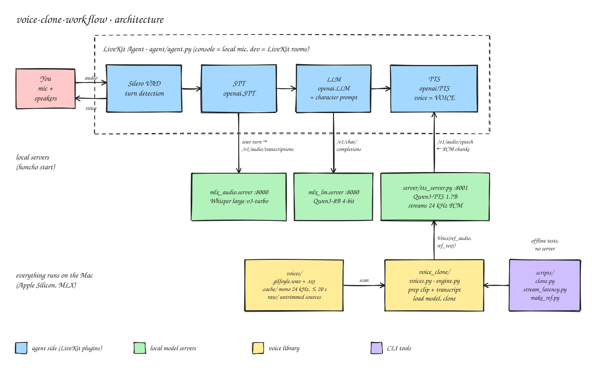

# voice-clone-workflow

Clone a voice from a 10–20 second clip and talk to it in real time, **fully local on an Apple Silicon Mac**.
Speech-to-text, the LLM and zero-shot voice cloning all run on [MLX](https://github.com/ml-explore/mlx);
[LiveKit Agents](https://docs.livekit.io/agents/) handles turn-taking, interruptions and audio I/O.



<sub>Editable source: [`docs/architecture.excalidraw`](docs/architecture.excalidraw) (open at excalidraw.com).</sub>

## What's inside
| Path | What |
|---|---|
| `voice_clone/voices.py` | Voice library: every `voices/<name>.<audio>` is a voice. Converts it to mono 24 kHz (≤ 20 s) and auto-transcribes it with Whisper |
| `voice_clone/engine.py` | Loads the TTS model once and clones a voice, whole or streamed |
| `server/tts_server.py` | OpenAI-compatible `POST /v1/audio/speech` that streams the cloned voice as 24 kHz PCM |
| `agent/agent.py` | LiveKit agent: Silero VAD → Whisper → Qwen3 → cloned voice, all over localhost |
| `scripts/` | `clone.py` (offline clone + RTF), `stream_latency.py` (time to first audio), `make_ref.py` (cut a sample), `transcribe.py` |
| `Procfile` | `honcho start` runs the three servers |

**Models (defaults, swappable in `.env`):** TTS [Qwen3-TTS 1.7B Base 8-bit](https://huggingface.co/mlx-community/Qwen3-TTS-12Hz-1.7B-Base-8bit),
STT Whisper large-v3-turbo, LLM Qwen3-8B 4-bit. All via [mlx-audio](https://github.com/Blaizzy/mlx-audio) / mlx-lm.

## Requirements
- Mac with Apple Silicon (M1 or later), macOS, ~16 GB RAM (32 GB comfortable); ~10 GB disk for models
- [Homebrew](https://brew.sh); `setup.sh` installs `uv` and `ffmpeg` if missing

## Quick start
```bash
./setup.sh && source .venv/bin/activate
```

**1. Add a voice.** Drop a clip in `voices/`, named after the voice, and set `VOICE` in `.env`:
```bash
cp ~/Downloads/narrator.m4a voices/narrator.m4a     # 10–20 s, one speaker, no music
# .env: VOICE="narrator"
```
To cut the good part out of a longer recording: `python scripts/make_ref.py narrator voices/raw/talk.mp4 --start 42 --duration 14`.

**2. Test cloning offline.** The first run downloads the models and writes `voices/narrator.txt` (Whisper
transcript). **Check that transcript**: cloning needs it word for word.
```bash
python scripts/clone.py && afplay out/clone_narrator_*.wav
python scripts/stream_latency.py        # time to first audio; aim for < ~500 ms
```

**3. Talk to it.**
```bash
honcho start                                  # terminal 1: LLM :8080, STT :8000, TTS :8001
python agent/agent.py download-files          # terminal 2, once
python agent/agent.py console                 # talk through the Mac's mic
```
`python agent/agent.py dev` joins LiveKit rooms instead (set `LIVEKIT_URL`, `LIVEKIT_API_KEY`, `LIVEKIT_API_SECRET`).

## Using the TTS server on its own
Any OpenAI-compatible client works; `voice` is the file name in `voices/`.
```bash
uvicorn server.tts_server:app --port 8001
curl -s localhost:8001/v1/audio/speech -H 'Content-Type: application/json' \
  -d '{"input":"Hello from a cloned voice.","voice":"narrator","response_format":"pcm"}' -o /tmp/t.pcm
ffmpeg -y -loglevel error -f s16le -ar 24000 -ac 1 -i /tmp/t.pcm /tmp/t.wav && afplay /tmp/t.wav
```
With LiveKit: `openai.TTS(base_url="http://127.0.0.1:8001/v1", api_key="local", voice="narrator", response_format="pcm")`.
New files in `voices/` are picked up on the first request for that name; edited transcripts need a restart.

## Configuration (`.env`)
| Var | Default | |
|---|---|---|
| `VOICE` | `gilfoyle` | file name in `voices/` |
| `TTS_MODEL` / `STT_MODEL` / `LLM_MODEL` | see `.env.example` | any mlx-community model of that kind |
| `CHARACTER_PROMPT` | a short persona + `/no_think` | the agent's system prompt |
| `TTS_STREAM_INTERVAL` | `0.64` | seconds of audio per streamed chunk (lower = earlier first audio) |
| `TTS_MAX_REF_SECONDS` | `20` | longer clips are cut |
| `LLM_PORT` / `STT_PORT` / `TTS_PORT` | 8080 / 8000 / 8001 | |

A/B other TTS models: `python scripts/clone.py --model mlx-community/Qwen3-TTS-12Hz-0.6B-Base-8bit`.
Other mlx-audio models (Chatterbox, OmniVoice, Higgs Audio) may take different cloning arguments.

## Troubleshooting
The TTS server logs, per sentence, `first audio in N ms` and `done: X s audio for N chars (RTF)`.
About 13–16 characters per second of audio is normal.

| Symptom | Cause / fix |
|---|---|
| Much less audio than text, or only the start and end of sentences | Transcript missing or wrong: Qwen3-TTS only clones with clip **and** exact transcript. Fix `voices/<name>.txt`. On M5 Macs also make sure mlx and mlx-audio are current (`uv pip install -U mlx`, mlx-audio from git; [#464](https://github.com/Blaizzy/mlx-audio/issues/464)) |
| `400 unknown voice` | No `voices/<name>.*`, or the server is an old process: restart it (`lsof -ti:8001 \| xargs kill`) |
| Voice sounds off / artifacts | Cleaner clip: one speaker, no music (Demucs, see `voices/README.md`), 10–20 s, good source quality |
| Slow first reply | Qwen3 reasoning: keep `/no_think` in `CHARACTER_PROMPT`; try a smaller LLM or the 0.6B TTS |

More in [`.claude/docs/troubleshooting.md`](.claude/docs/troubleshooting.md).

## Responsible use
Only clone voices you have the right to use. A clone of a real person's voice, published or shared, can
infringe their rights and can be used to deceive. Voice samples and transcripts are gitignored so they never
end up in the repo.

## License
Code: MIT. Models have their own licenses (Qwen3-TTS: Apache 2.0; check each model card).
