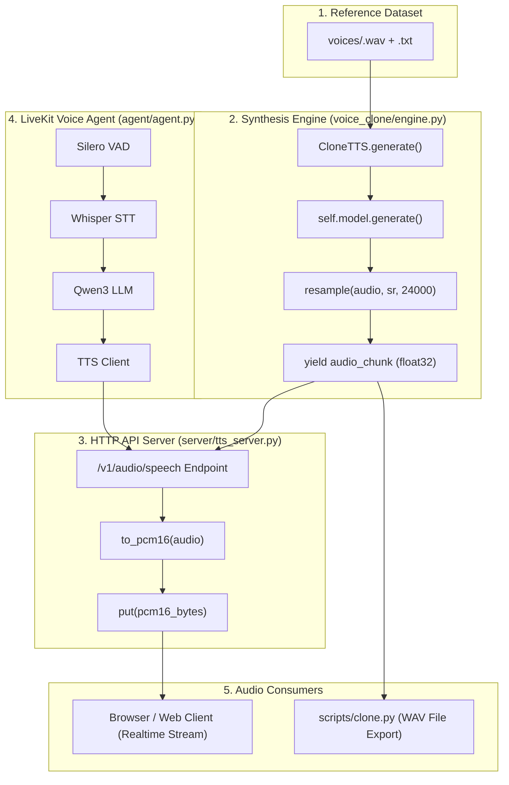

# Voice Cloning & Streaming Audio Architecture

This document explains the end-to-end architecture, generator flow, and audio format conversions across the **Voice Clone Workflow** repository.

---

## 🎨 Interactive Excalidraw Visualizer

For an interactive browser experience:
Open [`docs/architecture_flow.html`](file:///Users/shivam/MyProjects/voice-cloning/voice-clone-workflow/docs/architecture_flow.html) in your web browser.

---

## 🏗️ High-Level System Architecture



---

## 🔄 The `yield` Audio Streaming Flow Explained

The core synthesis engine in `voice_clone/engine.py` is built around Python **generators**:

```python
for r in self.model.generate(text=text, ref_audio=str(voice.ref_audio), ref_text=voice.ref_text, **kwargs):
    sr = int(getattr(r, "sample_rate", self.sample_rate) or self.sample_rate)
    yield resample(np.asarray(r.audio, dtype=np.float32).reshape(-1), sr, OUT_SR)
```

### Why `yield` matters here:

1. **Zero-Wait Time-to-First-Audio (TTFA):**
   Chunk #1 is synthesized, resampled, and yielded in **~100 ms**. The client starts playing audio through the speakers immediately while Chunk #2 is still being synthesized by the ML model.

2. **Memory Efficiency:**
   Instead of accumulating minutes of audio arrays in RAM, only **1 chunk** resides in memory at any given instant.

3. **Incremental Consumption:**
   When `server/tts_server.py` consumes the generator using `for audio in TTS.generate(...)`, it reads each chunk as it becomes available and converts it to **PCM16**.

---

## 🔊 Audio Format Transformations

| Stage | Module | Data Type / Representation | Description |
| :--- | :--- | :--- | :--- |
| **1. Reference Audio** | `voices/` | `.wav` / `.mp3` file | 3–10s audio clip of target speaker |
| **2. Model Output** | `mlx_audio` | `np.ndarray` (`float32`) | Raw model output at native sample rate |
| **3. Engine Output** | `voice_clone/engine.py` | `np.ndarray` (`float32` @ 24 kHz) | Resampled mono float32 audio arrays |
| **4. Network Stream** | `server/tts_server.py` | `bytes` (`int16 PCM` / PCM16) | Signed 16-bit integers (`-32768` to `+32767`) |
| **5. File Export** | `scripts/clone.py` | `.wav` file (`int16` / `float32`) | Concatenated continuous audio on disk |

---

## 🛠️ Main Component Registry

### 1. `voice_clone/engine.py` (`CloneTTS`)
- **`__init__()`**: Loads MLX TTS model into Metal/GPU memory.
- **`generate()`**: Primary generator function yielding 24 kHz float32 audio chunks.
- **`warm_up()`**: Synthesizes `"Ready."` on startup to pre-compile Metal kernels and encode target voice reference embeddings.

### 2. `server/tts_server.py`
- Exposes OpenAI-compatible `/v1/audio/speech` endpoint.
- Reads `TTS.generate(..., stream=True)`, converts each float32 chunk to `to_pcm16(audio)`, and feeds a thread-safe queue streaming bytes to the client.

### 3. `agent/agent.py`
- Full-duplex local voice assistant built on LiveKit Agents.
- Integrates **Silero VAD** $\rightarrow$ **Whisper STT** $\rightarrow$ **Qwen3 LLM** $\rightarrow$ **Local TTS Stream**.

### 4. `scripts/`
- **`clone.py`**: Offline synthesis to WAV.
- **`stream_latency.py`**: Measures latency metrics (Time-To-First-Audio).
- **`make_ref.py`**: Prepares and transcribes new reference voice samples.
